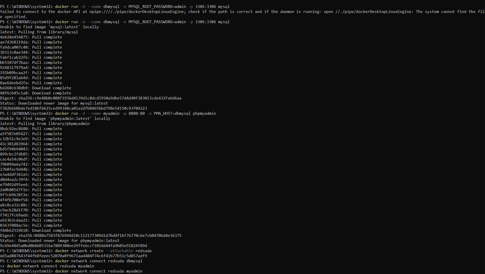
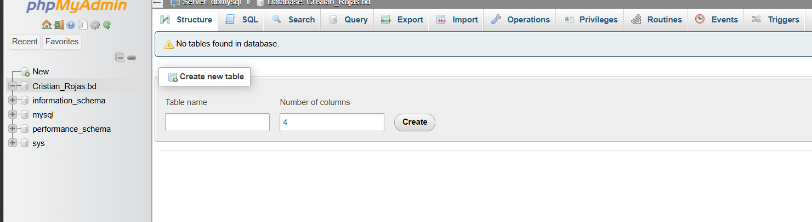

# Práctica No. 3: Puertos y Red en Contenedores

**Autor:** Christian Rojas  
**Institución:** Instituto Sudamericano  
**Ciclo:** Cuarto - Tecnología en Desarrollo de Software  

---

## 1. Título
Implementación de Redes Personalizadas en Docker: Conexión entre MySQL y phpMyAdmin.

## 2. Tiempo de Duración
Aproximadamente 45 minutos.

## 3. Fundamentos
Docker es una plataforma de virtualización a nivel de sistema operativo que permite ejecutar aplicaciones en contenedores aislados. A diferencia de las máquinas virtuales tradicionales, los contenedores comparten el kernel del sistema operativo anfitrión, lo que los hace mucho más ligeros y eficientes en el uso de recursos.

Para comprender el funcionamiento de las redes en entornos de contenedores, es fundamental conocer ciertos conceptos clave relacionados con la comunicación entre sistemas. La teoría que sustenta la conexión entre dos computadoras tradicionales también aplica a los contenedores, ya que pueden considerarse como instancias aisladas.

Entre los conceptos más importantes destacan:
* **Dirección IP:** Es el identificador único que permite a un contenedor comunicarse con otros en una red.
* **Puerto:** Es un número que permite diferenciar múltiples servicios que se ejecutan en un mismo dispositivo. Múltiples aplicaciones pueden escuchar por conexiones en distintos puertos de una misma IP.
* **Redes Docker (Bridge):** Docker proporciona comandos para gestionar redes personalizadas. Una vez que los contenedores están conectados a una misma red, se comunican entre sí utilizando su nombre de contenedor, evitando depender de las direcciones IP internas que cambian dinámicamente.

## 4. Conocimientos Previos
Para realizar esta práctica, el estudiante necesita tener claros los siguientes temas:
* Comandos básicos de consola (CMD/PowerShell o Linux).
* Manejo de la interfaz de línea de comandos (CLI) de Docker (`run`, `network create`, `network connect`).
* Conceptos básicos de bases de datos relacionales y puertos de red.
* Uso de navegador web para probar servicios locales (`localhost`).

## 5. Objetivos a Alcanzar
* Crear un contenedor para MySQL, definiendo las credenciales necesarias.
* Crear un contenedor para phpMyAdmin, configurando la conexión al motor de base de datos.
* Crear una red personalizada en Docker que permita la comunicación aislada entre ambos.
* Conectar ambos contenedores a la red creada.
* Crear una base de datos de prueba desde la interfaz gráfica evidenciando el éxito de la conexión.

## 6. Equipo Necesario
* Computador con sistema operativo Windows.
* Docker Desktop instalado y en ejecución.
* Terminal de comandos (CMD o PowerShell).
* Navegador Web (Chrome, Edge, Firefox).

## 7. Material de Apoyo
* Documentación oficial de Docker.
* Video tutorial de la asignatura sobre contenedores y redes.
* Imágenes oficiales de MySQL y phpMyAdmin en Docker Hub.

## 8. Procedimiento

**Paso 1: Creación de la Red Personalizada**
Primero, se creó una red en Docker llamada `redsuda` para permitir que los contenedores se encuentren entre sí de forma segura.
```bash
docker network create --attachable redsuda
```

**Paso 2: Creación de Contenedores y Mapeo de Puertos**
Se descargaron y ejecutaron las imágenes de MySQL y phpMyAdmin. Se definieron las contraseñas mediante variables de entorno (`-e`) y se mapearon los puertos locales hacia los puertos internos de los contenedores (`-p`). Finalmente, se conectaron ambos contenedores a la red `redsuda`.


*Figura 1-1. Ejecución de comandos para levantar contenedores y conectarlos a la red.*

**Paso 3: Verificación del Estado en Docker**
Una vez ejecutados los comandos, se verificó mediante la interfaz de Docker Desktop que ambos contenedores (`dbmysql` y `myadmin`) se encontraban en ejecución y con los puertos correctamente expuestos (3306 y 8080 respectivamente).


*Figura 1-2. Verificación de contenedores activos en Docker Desktop.*

**Paso 4: Conexión y Creación de Base de Datos**
Se ingresó a través del navegador a `http://localhost:8080`. Gracias a la red creada, phpMyAdmin logró conectarse exitosamente al contenedor de MySQL. Se inició sesión con las credenciales configuradas y se creó la base de datos de prueba.


*Figura 1-3. Interfaz de phpMyAdmin evidenciando la creación de la base de datos.*

## 9. Resultados Esperados
Al finalizar la práctica se comprobó que es posible aislar servicios en diferentes contenedores (el motor de base de datos por un lado y la interfaz gráfica por otro) y hacer que trabajen en conjunto. La creación de la red personalizada `redsuda` fue el puente que permitió que phpMyAdmin resolviera la ubicación de MySQL utilizando únicamente el nombre del contenedor, logrando así administrar la base de datos desde el navegador web local.

## 10. Bibliografía
* Miell, I., & Sayers, A. (2019). *Docker in practice*. Simon and Schuster.
* Nickoloff, J., & Kuenzli, S. (2019). *Docker in action*. Simon and Schuster.
* Instituto Sudamericano. (2026). *Postgresql y pgAdmin con docker - Puertos y red en contenedores* [Archivo de Video]. YouTube. https://youtu.be/F_aL2Aw5wcE
